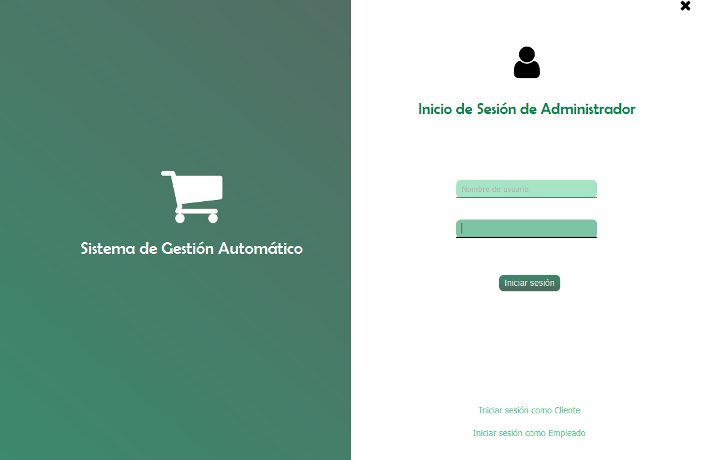
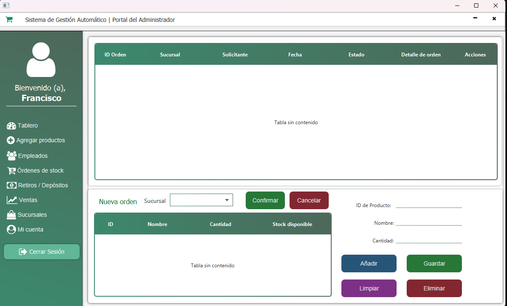

# SuperTiendaFI
Desktop app to manage sales, orders, inventory and income for RoboTICs Company. This project aims to provide a powerful tool to keep track of every single aspect of the company’s physical stores, such as:

- Sales: Record and analyze the revenue, profit, and customer satisfaction of each store and product category.
- Orders: Manage the incoming and outgoing orders of products, suppliers, and customers, and optimize the delivery time and cost.
- Inventory: Monitor and control the stock level, availability, and quality of products in each store and warehouse, and prevent overstocking or understocking.
- Income: Generate and export detailed reports of the income statement, balance sheet, and cash flow of each store and the company as a whole.

The app is developed using JavaFX and Font Awesome FX libraries, and uses MySQL as the database. It has a user-friendly and responsive interface, and supports multiple languages and currencies. The app is designed to be scalable, secure, and reliable, and can handle large amounts of data and transactions.

## This project makes use of

## Members
- Francisco Abimael Oro Estrada
- Juan Carlos Torres Chávez
- José Ángel Vázquez
- Oween Isaac Bailón Cruz

## Gallery

## License
This project is licensed under the [BSD-3-Clause license](https://github.com/francisco-oro/SuperTiendaFI/blob/main/LICENSE)

## Contributions 
If you have any suggestions, please reach out to Francisco Oro via email: 
- francisco_oro@phionira.com 
- francisco.oro@comunidad.unam.mx